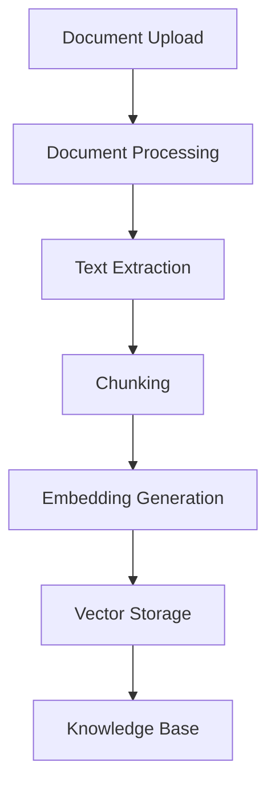
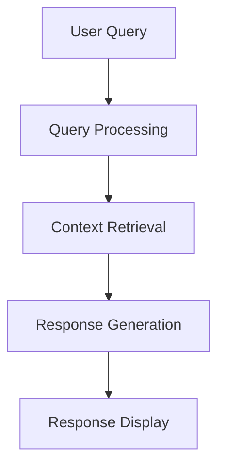
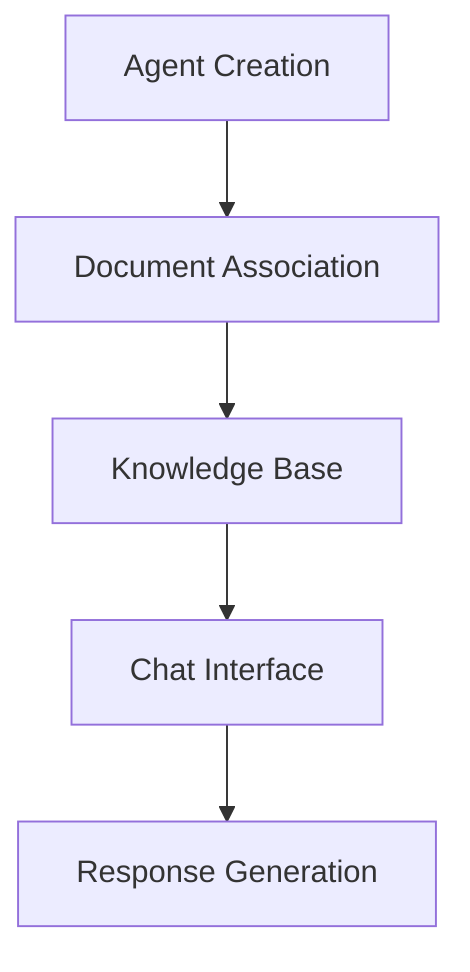

# Personalized AI Agent Platform

A Flask-based web application that enables users to create and train their own personalized AI agents. Users can feed their agents with custom knowledge through documents or websites, allowing them to build specialized assistants for various purposes like learning, data analysis, and knowledge management.

## Key Features

- **Personalized Agents**: Create custom AI agents tailored to your specific needs
- **Multi-Source Learning**: Train agents using documents, websites, or direct text input
- **Interactive Chat**: Natural conversation interface with context-aware responses
- **Document Management**: Support for multiple file formats and web content
- **Knowledge Base**: Persistent storage of agent knowledge and learning history

## Use Cases

1. **Learning Assistant**
   - Upload educational materials and tutorials
   - Create an agent specialized in specific subjects
   - Get personalized explanations and practice questions
   - Track learning progress through conversations

2. **Data Analysis Assistant**
   - Feed spreadsheets and reports
   - Create an agent that understands your data structure
   - Get insights and answer questions about your data
   - Track trends and patterns

3. **Research Assistant**
   - Process research papers and articles
   - Create an agent specialized in your field
   - Get summaries and detailed explanations
   - Track research findings and connections

4. **Knowledge Management**
   - Upload company documents and procedures
   - Create an agent that knows your organization
   - Get quick answers about policies and processes
   - Maintain institutional knowledge

5. **Personal Knowledge Base**
   - Upload personal notes and documents
   - Create an agent that knows your interests
   - Get personalized recommendations
   - Track your knowledge growth

## Quick Start Guide

1. **Create an Agent**
   - Launch the application
   - Enter an agent name in the "Create New Agent" section
   - Click "Create Agent" to initialize your AI assistant

2. **Train Your Agent**
   - Upload relevant documents (PDF, DOCX, XLSX, CSV)
   - Process web content from tutorials or articles
   - The agent will learn and build its knowledge base
   - Monitor the training progress

3. **Interact with Your Agent**
   - Ask questions about the uploaded content
   - Get personalized responses based on your materials
   - Use the expand button for a full-screen chat experience
   - Clear chat history or update documents as needed

## System Architecture

### 1. Document Processing Pipeline



#### Detailed Steps:
1. **Document Upload**
   - Accepts PDF, DOCX, XLSX, CSV files
   - Supports direct URL processing
   - Validates file types and sizes

2. **Text Extraction**
   - PDF: Uses PyPDF2 for text extraction
   - DOCX: Uses python-docx for structured content
   - XLSX: Uses pandas for tabular data
   - CSV: Direct text processing
   - URLs: Web scraping with BeautifulSoup

3. **Text Chunking**
   - Splits documents into manageable chunks
   - Maintains context and relationships
   - Configurable chunk size and overlap

4. **Embedding Generation**
   - Uses OpenAI's text-embedding-ada-002 model
   - Converts text chunks into vector representations
   - Enables semantic search capabilities

5. **Vector Storage**
   - Stores embeddings in ChromaDB
   - Maintains document metadata
   - Enables efficient similarity search

### 2. Chat Interface



#### Components:
1. **Query Processing**
   - Natural language understanding
   - Query intent analysis
   - Context preparation

2. **Context Retrieval**
   - Semantic search in vector store
   - Relevant document chunk selection
   - Context window management

3. **Response Generation**
   - Uses OpenAI's GPT-3.5-turbo model
   - Incorporates retrieved context
   - Maintains conversation history

4. **Response Display**
   - Real-time message updates
   - Source attribution
   - Interactive chat interface

### 3. Agent Management



#### Features:
1. **Multiple Agents**
   - Create separate agents for different purposes
   - Independent knowledge bases
   - Isolated chat histories

2. **Document Management**
   - Add/remove documents per agent
   - Track document processing status
   - Monitor chunk counts

3. **Agent Switching**
   - Seamless agent switching
   - Context preservation
   - Independent chat histories

## Technical Requirements

- Python 3.8+
- Flask
- LangChain
- ChromaDB
- OpenAI API
- Required Python packages (see requirements.txt)

## Installation

1. Clone the repository:
```bash
git clone <repository-url>
cd <repository-name>
```

2. Install dependencies:
```bash
pip install -r requirements.txt
```

3. Set up environment variables:
```bash
export OPENAI_API_KEY='your-api-key'
```

4. Run the application:
```bash
python app.py
```

## API Endpoints

- `/create_agent`: Create a new AI agent
- `/upload`: Upload and process documents
- `/process_url`: Process web content from URLs
- `/chat`: Handle chat interactions
- `/list_agents`: List all available agents
- `/list_documents`: List documents for current agent
- `/delete_document`: Remove a document
- `/delete_agent`: Remove an agent
- `/clear_chat`: Clear chat history
- `/delete_all_documents`: Remove all documents

## Error Handling

- File type validation
- API error management
- Rate limiting
- Timeout handling
- Retry mechanisms

## Security Features

- API key management
- File type validation
- Input sanitization
- Rate limiting
- Error handling

## Contributing

1. Fork the repository
2. Create a feature branch
3. Commit your changes
4. Push to the branch
5. Create a Pull Request

## License

This project is licensed under the MIT License - see the LICENSE file for details. 